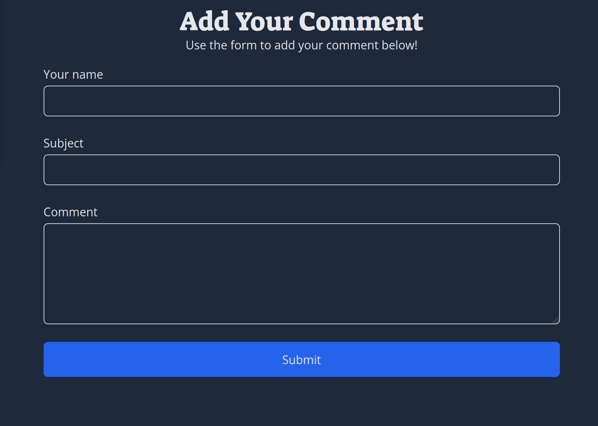

   

# Go-Web-App

## About

This is a web app built with Go and HTML. In this example, you can create and edit comments. [Visit the site here.](https://go-web-app-q9ez.onrender.com)

### Built With

- [Go 1.22.2](https://go.dev/)
- [Fiber](https://docs.gofiber.io/)
- [Go SQLite3](https://github.com/mattn/go-sqlite3)
- [HTML/Templates](https://pkg.go.dev/html/template)
- [TailwindCSS](https://tailwindcss.com/)
- [HTMX](https://htmx.org/)
- [Docker](https://www.docker.com/)

## Usage

1. Enter text for name, subject, and comment text. All fields are required.
2. Once your comment is submitted, it will appear below the form.
3. Click the trash icon button to delete the comment.

## Contact

Alexis Woelffer
 

(<a href="#readme-top">back to top</a>)

